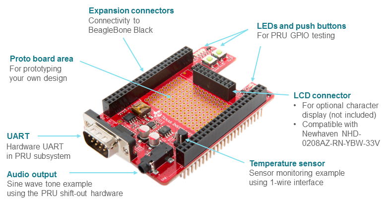
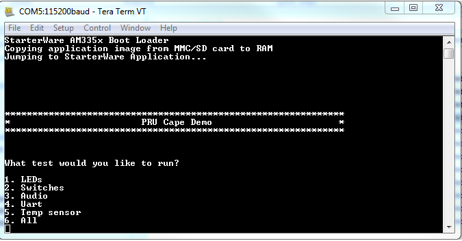

# PRU Cape Getting Started Guide

## Introduction

This guide is intended to walk through the basic instructions on how to get started with your
PRU Cape using the available demo software.

The PRU Cape is a test, development, and evaluation module system that enables developers to
write software and develop hardware around the PRU subsystem.
The diagram below shows the basic features supported by the cape.
For more details about the PRU Cape hardware, please refer to the [PRU Cape Hardware User Guide]().

## Prerequisites

The hardware and software prerequisites needed to run the getting started demo are listed below.

### Hardware

- BeagleBone or BeagleBone Black (Can be ordered from beagleboard.org)

- BeagleBone PRU Cape (Can be ordered from ti.com)

- MicroSD card formatted as FAT32

- USB cable to power BeagleBone or BeagleBone Black

- FTDI cable for BeagleBone Black serial debug port (not required for original BeagleBone)

- Speakers or headphones for audio demo

- RS-232 serial cable for hardware UART demo

### Software

The PRU Cape Demo Software is available in the
[PRU Software Support Package](https://git.ti.com/pru-software-support-package/pru-software-support-package/)
hosted on git.ti.com.
To download this package, select the "Source Tree" button from the PRU Software Support Package
webpage and then click "Download master as tar.gz."
In Windows, a program such as 7-zip can be used to open the downloaded file and extract the
software package contents.

To RUN the PRU Cape demos, the following software is required:

- [PRU Cape Demo Binaries](https://git.ti.com/pru-software-support-package/pru-software-support-package/trees/master/pru_cape/bin)
  (available in the pru_cape/bin directory of the PRU Software Support Package)

- Terminal program (such as Teraterm or Hyperterminal)

<b>NOTE:</b> This wiki will specifically cover how to run the demos based on Starterware and thus,
provides an example of interacting with the PRU using a non-Linux OS.
However, Linux or CCS can also be used to load and run the demos.
The basic procedure for using Linux with the PRU is described in the PRU-SW Getting Started Guide.

## Preparing the Environment

### Prepare the SD Card

- Plug the MicroSD card into your host computer

- Format the MicroSD card with the HP USB Disk Storage Format Tool v2.0.6 Portable.
  Formatting instructions and a download link can be found at [http://processors.wiki.ti.com/index.php/AM335X_StarterWare_Booting_And_Flashing#Booting_Via_SD_Card](http://processors.wiki.ti.com/index.php/AM335X_StarterWare_Booting_And_Flashing#Booting_Via_SD_Card).

- Copy the demo binaries (StarterWare bootloader - MLO and demo binary - app, found under
  the pru_cape/bin directory of the PRU Software Support Package) to the MicroSD card

### Ready your Host PC - Serial Terminal

In order to communicate with the BeagleBone Black and run the PRU Cape demos, a serial port terminal
program must be installed on your host PC.
For Windows, you could use Teraterm or PuTTY.
For Linux, we recommend Minicom.

Use the following settings when connecting to the the PC's serial port terminal program:

   Baud rate: 115200

   Data : 8 bit

   Parity: None

   Stop: 1 bit

   Flow control: none

### Setup your BeagleBone Black

This section will walk you through setting-up your Beaglebone Black for use with the PRU Cape demos.

1. Plug the PRU Cape into the BeagleBone Black. Be sure the board is aligned correctly based on the
   cape-cutout for the Ethernet jack.

2. Insert the MicroSD card loaded with the latest PRU Cape Demo Images into the BeagleBone Black.

3. Plug the FTDI cable into your host PC and connect to the BeagleBone Black.

4. Plug the headphones or speakers into the audio jack on the PRU Cape.

5. Connect the RS-232 cable to the RS-232 port on the PRU Cape and to your host PC.

6. Open two serial terminals on your host PC connected to the FTDI cable and the RS-232 cable.

7. Plug the USB cable into the BeagleBone Black and your host PC to power on the board.

## Running the Demos

This section will walk you through actually running the PRU Cape demo code.
Note the following instructions assume all steps in the Preparing the Environment section have been followed.

### Steps to Run the Demos

1. To boot the board, simply apply power to the BeagleBone Black by plugging in the USB cable to both the
   board and your host PC.
   If the FTDI cable is plugged in and the debug serial port is configured correctly, you should see the
   output on your serial terminal.

   

2. In the console (shown above), type the number of the demo you would like to run and press ‘enter.’
   To run all demos, select ‘6.’

### LED Demo

The LED Demo uses the PRU0 and PRU1 R30 GPOs (Direct Output Mode) to toggle all PRU Cape LEDs.
There are 4 LEDs connected to PRU0 GPO0-3, and 3 connected to PRU1 GPO3-5.

In this demo, the user should observe the 4 LEDs (D1-D4) and the 3 LEDs (D5-D7) blinking on and off.

### Push Button Switch Demo

The Push Button Switch Demo uses the PRU0 R31 GPIs (Direct Input Mode) to read 2 push button switches
and toggle LEDs connected to the PRU0 R30 GPO (Direct Output Mode).

In this demo, the user should observe the following when each switch is pressed:

- Press SW1 --> LEDs D1 & D2 turn on

- Press SW2 --> LEDs D3 & D4 turn on

### Audio Demo

The Audio Demo uses the PRU GPO Shift Out mode to transmit a single audio tone to an external
8 bit DAC, headphone amplifier, and headphone jack.
In this application, the PRU reads an array that contains a sine wave in 8bit format, reformats
the data to be compliant with the DAC, shifts out the data and generates sync signals.
This sine wave is written to both the left and right channels of the headphone jack.

This demo requires the headset or speaker to be inserted into the headphone jack.
During the demo, a single tone will be played.

### UART Demo

The UART Demo uses the PRU to control the hardware UART peripheral (pr1_uart0),
which is located within the PRU subsystem.

This demo requires the RS-232 cable to be connected to the PRU Cape's RS-232 port and the
host PC, with a serial terminal opened on the PC.
During the demo, the following message should appear on the terminal connected to the RS-232 cable:

   “Hello you are in the PRU UART demo test please enter 5 characters”

The user should type any 5 characters.
After typing the 5th character, the console will display the 5 characters entered by the tester.

### HDQ/Temperature Sensor Demo

The HDQ/Temperature Sensor Demo uses the PRU to periodically sample a temperature sensor (TEMP1)
and toggle a Red LED if the temperature rises or a Blue LED if the temperature falls.
A bit-banged 1-Wire interface is implemented on PRU0 to communicate with the external temperature
sensor.

In this demo, the user can cover TEMP1 with their hand, causing the temperature around the sensor
to rise.
The Red LED (D7) should turn on as the temperature increases.
After observing the Red LED turn on, the user can remove their hand and cause the temperature
around the sensor to fall.
The Blue LED (D5) should turn on as the temperature decreases.
When the temperature is constant, both LEDs should be off.

The LED color map for this demo is summarized below:

- Temp increases --> Red LED (D7) on, Blue LED (D5) off

- Temp constant --> Red LED (D7) off, Blue LED (D5) off

- Temp decreases --> Red LED (D7) off, Blue LED (D5) on

### All

Selecting the "All" option will play each demo one at a time in the order displayed on the serial terminal.
Through the serial terminal, the user will control when the next demo begins.

## Editing and Rebuilding Demos

For details about rebuilding the PRU Demo source code, visit the
[PRU Cape: Building Demos Guide](https://processors.wiki.ti.com/index.php/PRU_Cape:_Building_Demos).

## Legal

- [Standard Terms and Conditions for Evaluation Modules](https://processors.wiki.ti.com/images/7/7c/Sszz027h.pdf).

This page was last edited on 1 December 2014, at 18:17.

Content is available under [Creative Commons Attribution-ShareAlike](http://creativecommons.org/licenses/by-sa/3.0/) unless otherwise noted.

[Privacy policy](https://processors.wiki.ti.com/index.php/Project:Privacy_policy) [About Texas Instruments Wiki](https://processors.wiki.ti.com/index.php/Project:About) [Disclaimers](https://processors.wiki.ti.com/index.php/Project:General_disclaimer) [Terms of Use](https://processors.wiki.ti.com/index.php/Project:Terms_of_Service)

