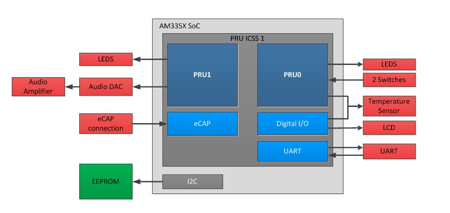

# PRU Cape Hardware User Guide

## Introduction

This document describes the hardware architecture of the PRU Cape  which is compatible
with the Beagle Bone Black development platform. 

## Description

The PRU Cape is a test, development, and evaluation module system that enables developers
to write software and develop hardware around the PRU subsystem.
Examples of basic I/O such as push buttons and LEDs as well as more complicated examples such as audio and 1-Wire for temperature sensing are available on this cape to showcase what the PRU can accomplish in terms of inputs and outputs.

The following sections give more details regarding the PRU Cape

## EVM System View

The PRU Cape is shown below in Figure 1.

## Schematics/Design/Errata Files

[Design Files](http://www.ti.com/tool/prucape) (located under Technical Documents), includes:

- Schematic

- Layout

- Assembly Drawings

- CAD Files

- Bill of Materials (BOM)

[Errata](https://processors.wiki.ti.com/index.php/PRU_Cape_Hardware_User_Guide#Schematics.2FDesign.2FErrata_Files)

- I2C SCL and SDA signals swapped (REV 1.2A)
  The AM335x I2C2_SDA signal (routed to BBB Header P9-20) is connected to the EEPROM SCL pin.
  The AM335x I2C2_SCL signal (routed to BBB Header P9-19) is connected to the EEPROM SDA pin.
  The EEPROM is blank, and if it is to be used, the cape needs to be modified to physically swap the SDA and SCL signals.

[PRU Cape Getting Started Guide](PRU_GS.md)

## System Description

### System Board Diagram

The system block diagram of the PRU Cape are shown in Figure 2 and Figure 3.

