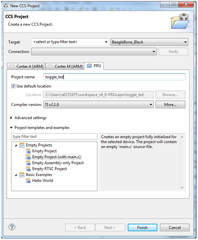
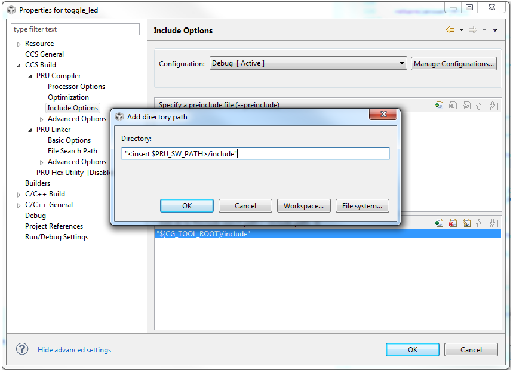
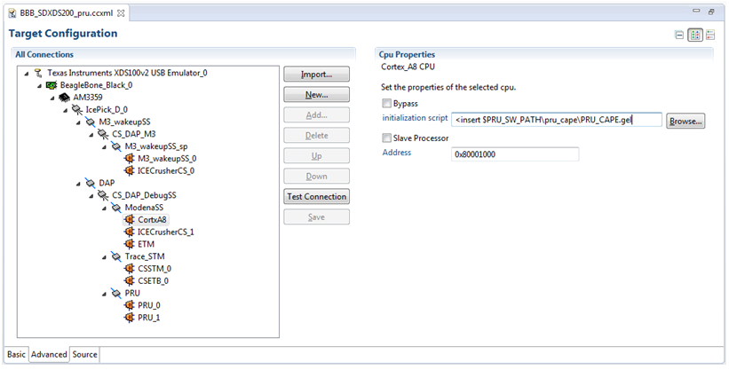

# PRU Training: Hands-on Labs

## Introduction

The labs provided on this page will give you a hands on tutorial of the PRU, C-compiler,
and Linux driver.
Each of the following sections below will walk you through a particular Lab exercise,
including the step-by-step instructions to complete the lab.

<b>NOTE:</b> In this guide commands to be executed for each step will be marked in <b>BOLD</b>.

## Lab Configuration

The following are the hardware and software configurations for this lab.
The steps in this lab are written against this configuration.
The concepts of the lab will apply to other configurations but will need to be adapted accordingly.

### Hardware

- AM335x Beaglebone Black - Order Now

- BeagleBone PRU Cape - Order Now

- 5V power supply or USB cable connection

- JTAG emulator

- FTDI cable

### Software

- [Linux Processor SDK](http://www.ti.com/tool/PROCESSOR-SDK-AM335X) installed.
  This lab assumes the latest Linux Processor SDK is installed in /home/sitara.
  If you use a different location please modify the below steps accordingly.

- The PRU Software Support Package is now included in the 'example-applications/pru-icss-x.y.z/'
  folder of the Linux Processor SDK (as of v2.0.2.11).
  If you are using RTOS or running Windows on your development machine, you can download
  the support package from the git repository [here](https://git.ti.com/pru-software-support-package/pru-software-support-package/trees/master).
  This lab assumes that the software package is installed in /home/sitara/<ti-sdk...>/example-applications/pru-icss-x.y.z.
  However, the notation <PRU_SW_PATH> will be used throughout the labs to reference
  this assumed installation location.
  If you use a different location please modify the steps below.

- [CCSv6](http://processors.wiki.ti.com/index.php/Download_CCS#Code_Composer_Studio_Version_6_Downloads)

- [PRU Code Generation Tools](http://software-dl.ti.com/codegen/non-esd/downloads/download.htm#PRU)
  (also available through the CCS App Center)

### Supported Platforms

This hands-on guide is focused on the AM335x processor on the Beaglebone Black due to the
availability of the PRU cape for this platform as well as access to the PRU pins externally.
However, the concept of loading/running firmwares described here will translate to the
AM437x and AM57xx devices as well.
The PRU Software Support Package supports all three of these devices.

## LAB 1: Toggle LED with PRU GPO

### Objective

Toggle an LED using the PRU0 R30 GPO in Direct Output Mode (default).

### Key Points

- Compile PRU code

- Load PRU code using CCS

- Step through PRU code in CCS

### Lab Steps

<b>NOTE :</b>
Before beginning, ensure that the kernel is not booting and/or already up and running.
BeagleBone Black has an eMMC device with a kernel pre-built and flashed ready for boot;
however, if the kernel loads prior to our connection to the ARM in CCS then you may
experience issues with the debugger.
These are primarily caused by the kernel enabling the MMU.
Use a minicom console to stop U-Boot to prevent the kernel from booting.

To work around this, first try popping out the microSD card if one is inserted.
If the blue LEDs on the BBB are toggling when power is applied, then the board is still
booting off the eMMC. On the BBB opposite the RJ-45 (Ethernet) connector, there is a push
button almost directly under the audio jack that may be difficult to access with the PRU
cape on.
Press and hold this while power is applied, then release.
You should no longer see the flashing lights.

1. Launch CCSv6 and select the default Workspace.

2. Create a new PRU project.

   a. Select <b>File->New->CCS Project</b>.

   b. In the far-right dropdown next to Target, <b>select BeagleBone_Black</b>.

   c. Select <b>PRU tab</b>, specify a <b>Project Name (toggle_led works well)</b>, and verify that Compiler version is <b>TI v2.1.0</b> or higher.

   d. Select <b>Finish</b>.
   


3. Main.c should open automatically. Let's start creating our example code!

   a. Include <b>stdint and pru_cfg</b> headers.

   b. Declare the <b>r30 register</b>.

```C
#include <stdint.h>
#include <pru_cfg.h>

volatile register uint32_t __R30;
```

4. Add the include path for the header files so that the compiler can find them.

   a. Select <b>Project->Properties</b>.

   b. Select <b>Build->PRU Compiler->Include Options</b>.

   c. In the box marked "Add dir to #include search path" <b>click the file icon with a green +</b>.

   d. Specify the <b>directory to the include file</b> which for the BeagleBone Black is <PRU_SW_PATH>/include/am335x

   <b>NOTE:</b>
   If there is already a ${CCS_BASE_ROOT}/pru/include directory, <b>delete</b> it by clicking the file icon with a red X.

   

5. Now we will begin coding inside the main function.

   a. Declare a <b>temporary variable called gpo</b> to represent GPO values.

   b. Set GPI and GPO to <b>Mode 0</b> (Direct Output).

   c. Create an infinite loop which <b>toggles the GPO pin(s)</b> and <b>delays one half second</b>.

```C
void main ()
{
  volatile uint32_t gpo; 
  /* GPI Mode 0, GPO Mode 0 */
  CT_CFG.GPCFG0 = 0;
  /* Clear GPO pins */
  __R30 = 0x0000;
  while (1)
  {
    gpo = __R30;
    gpo ^= 0xF;
    __R30 = gpo;
    __delay_cycles (100000000); // half-second delay
  }
}
```

6. Add the linker command file.

   a. Delete <b>AM335x.cmd</b> from the project folder, if it was added automatically.

   b. Select <b>Project->Add Files...</b>

   c. Navigate to the <PRU_SW_PATH>/labs/lab_1 folder and select the <b>AM335x_PRU.cmd</b> file.
   
   <b>NOTE:</b>

   Select <b>Copy files</b> and <b>OK</b> in the File Operation dialog box that appears when file is selected.
   
   !{fig_3](./Pru_lab1_fileopbox.png)

7. Build the project.

   a. Select <b>Project->Build All</b>.

   b. This should now compile successfully! If not, correct any errors until build completes.

8. Select View->Target Configurations to see a list of available configurations.
   <b>Note</b> that this list may be empty.

   a. To create a new one <b>right click in the white space</b> in the Target Configurations window and select
      <b>New Target Configuration</b>.

   b. Specify a <b>filename</b> (such as <b>BBB_SDXDS200_pru.ccxml</b> if using a XDS200 emulator) and select <b>Finish</b>.

   c. After the file opens select your <b>emulator</b> in the <b>Connection</b> drop-down.

   d. Under Board or Device select the <b>BeagleBone_Black</b>.

   e. Click the <b>Advanced</b> tab at the bottom of that window, select the <b>CortxA8 core</b>,
      and browse to the <b>PRU_CAPE.gel file</b> (found in <PRU_SW_PATH>/pru_cape).

   f. Click Save and close this file.

   

9. Let’s launch the debugger and load the code!

   a. In the "Target Configurations" view, right click the Target Configuration file we just created and select
      <b>Launch Selected Configuration</b>.
      Note that <b>Launch Selected Configuration</b> might not appear if you right click the file in a view other
      than "Target Configurations".

   b. After it loads right click on the CortxA8 core and select <b>Connect Target</b>.

   c. Run the GEL script under <b>Scripts->Initialization->PRU_Cape_Init</b>.
      <b>NOTE:</b>
      This runs basic initialization code for pin muxing.

   d. After the script runs, right click on the CortxA8 core and select <b>Disconnect Target</b>.

   e. Right click on the PRU_0 core and select <b>Connect Target</b>.

   f. Load the example you just build by selecting <b>Run->Load->Load Program</b>.

   g. Select Browse, navigate to the project directory (by default /home/sitara/workspace_6.0/toggle_led/debug/)
      and select the <b>toggle_led.out</b> file.

   h. Select the <b>green arrow</b> to run your code.

   i. You should now see the LEDs toggle!

10. When you're all done enjoying your work, terminate the debug session using the big red square.

## LAB 2: Read Push Button Switch on PRU0 GPI & Toggle LED with PRU1 GPO

### Objective

PRU multi-core communication.

### Lab Steps

1. Launch CCSv6 and select the default Workspace.

2. Create two new PRU projects – one for PRU0 and one for PRU1.

   a. Select <b>File->New->CCS Project</b>.

   b. In the far-right dropdown next to Target, select <b>BeagleBone_Black</b>.

   c. Select <b>PRU tab</b>, specify a <b>Project Name</b> (e.g., button_led_0 & button_led_1), and verify that
      Compiler version is <b>TI v2.1.0</b> or higher.

   d. Select <b>Finish</b>.

   e. <b>Remember to create two separate projects, button_led_0 & button_led_1</b>.

3. Copy the button_led_n.c and AM335x_PRU.cmd from the <PRU_SW_PATH>/labs/lab_2 directory into the new projects.

   a. You can do this by selecting <b>File->Open File</b>, navigating to the button_led_n.c and AM335x_PRU.cmd
      and <b>copying them to the project</b>.

   b. Alternatively, you can browse to the directory in an explorer window and drag/drop them as you would
      in Windows, or use Project->Add Files...

4. Remove main.c from the projects. main() has been implemented in button_led_n.c

5. Now we will begin modifying the code in button_led_0.c

   a. Include the <b>pru_intc.h header file</b>.
      Open it and examine the contents for a better understanding of the pruIntc structure.
      You should find it in <PRU_SW_PATH>/include

   b. Notice the new <b>declaration for the r31 register</b> as we did previously for the r30 register.
      This allows us to directly access this register to generate interrupts.

   c. Notice the <b>declarations for the interrupt</b> we will generate to signal to PRU1 that SW1 was pressed.
      The PRU cores can generate interrupts manually using events 16-31; however, these are mapped to bits [3:0]
      in the r31 register.
      Additionally we have to trigger bit  5 to strobe the interrupt.
      As an example, we pass 0b000 ORed with 0x20 to generate an interrupt on event 16.
      For more information see the definition of r31 writes in the device specific TRM.

   ```C
   /* Defines */
   /* PRU0-to-PRU1 interrupt */
   
   #define PRU0_PRU1_EVT (16)
   #define PRU0_PRU1_TRIGGER (__R31 = (PRU0_PRU1_EVT - 16) | (1 << 5))
   ```
   d. Define the <b>GPI offset</b> for SW1 which is located in GPI5.

   ```C
   /* SW1 offset */
   
   #define SW1 (1 << 5)
   ```

   e. Go to the <b>configIntc function</b>.
      This function is mostly intact, but you will need to <b>fill out the register values</b> in order to
      configure the interrupt.
      Refer to the PRU INTC register descriptions in the device specific TRM for register layouts.
      For this exercise you will want to configure these registers such that:

      1. <b>Event 16 is mapped to Channel 1</b>

      2. <b>Channel 1 is mapped to Host 1</b>

      3. <b>Ensure event 16 is clear</b>

      4. <b>Enable event 16</b>

      5. <b>Enable Host 1</b>

      6. <b>Globally enable interrupts</b>

      ```C
      /* Map event 16 to channel 1 */
      CT_INTC.CMR4_bit.CH_MAP_16 = 1;

      /* Map channel 1 to host 1 */
      CT_INTC.HMR0_bit.HINT_MAP_1 = 1;

      /* Ensure event 16 is cleared */
      CT_INTC.SICR = 16;

      /* Enable event 16 */
      CT_INTC.EISR = 16;

      /* Enable Host interrupt 1 */
      CT_INTC.HIEISR |= (1 << 0);

      /* Globally enable host interrupts */
      CT_INTC.GER = 1;
      ```

      <b>NOTE:</b>

      Remember that you can use the CodeCompletion feature within CCS for a list of available registers and
      bit fields in the structure!
      To access it simply hit Ctrl+space after the dot (it should also open automatically when you type the dot).

   f. Within the while(1) loop we are going to begin polling the status of the R31 register to determine if
   the button has been pressed. When the button is pressed, you will generate the interrupt to PRU1 and
   wait 500 ms as a cheap 'debounce'.

   ```C
   while(1)
   {
     if ((__R31 & SW1) != SW1)
     {
       /* Interrupt PRU1, wait 500 ms for cheap "debounce" */
       /* TODO: Trigger interrupt - see #defines */
       __delay_cycles(100000000); /* 500ms @ 200MHz */
     }
   }
   ```

   <b>NOTE:</b>

   The switches are active low so we are looking for it to go low.

6. Save the file, and then add the include directory to the Include Search Path to the button_led_0 project.

   a. Select <b>Project->Properties</b>.

   b. Select <b>Build->PRU Compiler->Include Options</b>.

   c. In the box marked "Add dir to #include search path" <b>click the file icon with a green +</b>.

   d. Specify the <b>directory to the include file</b> which for the BeagleBone Black is
      <PRU_SW_PATH>/include/am335x

   <b>NOTE:</b>

   If there is already a ${CCS_BASE_ROOT}/pru/include directory, <b>delete it</b> by clicking the file icon with a red X.

7. Select OK and <b>build the project</b>. This should now compile successfully! If not, correct any errors until build completes.

8. Let's go modify the code in button_led_1.c

   a. Include the <b>pru_intc.h header file</b>.

   b. Notice the <b>define for HOST1_MASK</b>.
      Hosts 0 and 1 are automatically mapped to bits 30 and 31, respectively, in the r31 register.
      To view the status of Host 1 we mask out the lower 31 bits.

   c. Create a <b>define to toggle the BLUE LED</b> which is located on <b>PRU1 GPO 3</b>.


