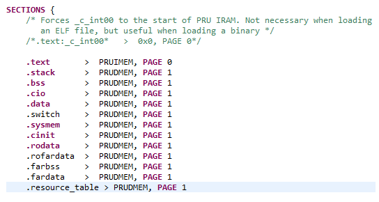

# PRU Training: Hands-on Labs

## Introduction

The labs provided on this page will give you a hands on tutorial of the PRU, C-compiler,
and Linux driver.
Each of the following sections below will walk you through a particular Lab exercise,
including the step-by-step instructions to complete the lab.

<b>NOTE:</b> In this guide commands to be executed for each step will be marked in <b>BOLD</b>.

## Lab Configuration

The following are the hardware and software configurations for this lab.
The steps in this lab are written against this configuration.
The concepts of the lab will apply to other configurations but will need to be adapted accordingly.

### Hardware

- AM335x Beaglebone Black - Order Now

- BeagleBone PRU Cape - Order Now

- 5V power supply or USB cable connection

- JTAG emulator

- FTDI cable

### Software

- [Linux Processor SDK](http://www.ti.com/tool/PROCESSOR-SDK-AM335X) installed.
  This lab assumes the latest Linux Processor SDK is installed in /home/sitara.
  If you use a different location please modify the below steps accordingly.

- The PRU Software Support Package is now included in the 'example-applications/pru-icss-x.y.z/'
  folder of the Linux Processor SDK (as of v2.0.2.11).
  If you are using RTOS or running Windows on your development machine, you can download
  the support package from the git repository [here](https://git.ti.com/pru-software-support-package/pru-software-support-package/trees/master).
  This lab assumes that the software package is installed in /home/sitara/<ti-sdk...>/example-applications/pru-icss-x.y.z.
  However, the notation <PRU_SW_PATH> will be used throughout the labs to reference
  this assumed installation location.
  If you use a different location please modify the steps below.

- [CCSv6](http://processors.wiki.ti.com/index.php/Download_CCS#Code_Composer_Studio_Version_6_Downloads)

- [PRU Code Generation Tools](http://software-dl.ti.com/codegen/non-esd/downloads/download.htm#PRU)
  (also available through the CCS App Center)

### Supported Platforms

This hands-on guide is focused on the AM335x processor on the Beaglebone Black due to the
availability of the PRU cape for this platform as well as access to the PRU pins externally.
However, the concept of loading/running firmwares described here will translate to the
AM437x and AM57xx devices as well.
The PRU Software Support Package supports all three of these devices.

## LAB 1: Toggle LED with PRU GPO

### Objective

Toggle an LED using the PRU0 R30 GPO in Direct Output Mode (default).

### Key Points

- Compile PRU code

- Load PRU code using CCS

- Step through PRU code in CCS

### Lab Steps

<b>NOTE :</b>
Before beginning, ensure that the kernel is not booting and/or already up and running.
BeagleBone Black has an eMMC device with a kernel pre-built and flashed ready for boot;
however, if the kernel loads prior to our connection to the ARM in CCS then you may
experience issues with the debugger.
These are primarily caused by the kernel enabling the MMU.
Use a minicom console to stop U-Boot to prevent the kernel from booting.

To work around this, first try popping out the microSD card if one is inserted.
If the blue LEDs on the BBB are toggling when power is applied, then the board is still
booting off the eMMC. On the BBB opposite the RJ-45 (Ethernet) connector, there is a push
button almost directly under the audio jack that may be difficult to access with the PRU
cape on.
Press and hold this while power is applied, then release.
You should no longer see the flashing lights.

1. Launch CCSv6 and select the default Workspace.

2. Create a new PRU project.

   a. Select <b>File->New->CCS Project</b>.

   b. In the far-right dropdown next to Target, <b>select BeagleBone_Black</b>.

   c. Select <b>PRU tab</b>, specify a <b>Project Name (toggle_led works well)</b>, and verify that
      Compiler version is <b>TI v2.1.0</b> or higher.

   d. Select <b>Finish</b>.

   

3. Main.c should open automatically. Let's start creating our example code!

   a. Include <b>stdint and pru_cfg</b> headers.

   b. Declare the <b>r30 register</b>.

```C
#include <stdint.h>
#include <pru_cfg.h>

volatile register uint32_t __R30;
```

4. Add the include path for the header files so that the compiler can find them.

   a. Select <b>Project->Properties</b>.

   b. Select <b>Build->PRU Compiler->Include Options</b>.

   c. In the box marked "Add dir to #include search path" <b>click the file icon with a green +</b>.

   d. Specify the <b>directory to the include file</b> which for the BeagleBone Black is <PRU_SW_PATH>/include/am335x

   <b>NOTE:</b> If there is already a ${CCS_BASE_ROOT}/pru/include directory, <b>delete</b> it by
   clicking the file icon with a red X.

   

5. Now we will begin coding inside the main function.

   a. Declare a <b>temporary variable called gpo</b> to represent GPO values.

   b. Set GPI and GPO to <b>Mode 0</b> (Direct Output).

   c. Create an infinite loop which <b>toggles the GPO pin(s)</b> and <b>delays one half second</b>.

```C
void main ()
{
  volatile uint32_t gpo; 
  /* GPI Mode 0, GPO Mode 0 */
  CT_CFG.GPCFG0 = 0;
  /* Clear GPO pins */
  __R30 = 0x0000;
  while (1)
  {
    gpo = __R30;
    gpo ^= 0xF;
    __R30 = gpo;
    __delay_cycles (100000000); // half-second delay
  }
}
```

6. Add the linker command file.

   a. Delete <b>AM335x.cmd</b> from the project folder, if it was added automatically.

   b. Select <b>Project->Add Files...</b>

   c. Navigate to the <PRU_SW_PATH>/labs/lab_1 folder and select the <b>AM335x_PRU.cmd</b> file.
   
   <b>NOTE:</b> Select <b>Copy files</b> and <b>OK</b> in the File Operation dialog box that
   appears when file is selected.
   
   !{fig_3](./Pru_lab1_fileopbox.png)

7. Build the project.

   a. Select <b>Project->Build All</b>.

   b. This should now compile successfully! If not, correct any errors until build completes.

8. Select View->Target Configurations to see a list of available configurations.
   <b>Note</b> that this list may be empty.

   a. To create a new one <b>right click in the white space</b> in the Target Configurations window and select
      <b>New Target Configuration</b>.

   b. Specify a <b>filename</b> (such as <b>BBB_SDXDS200_pru.ccxml</b> if using a XDS200 emulator) and select <b>Finish</b>.

   c. After the file opens select your <b>emulator</b> in the <b>Connection</b> drop-down.

   d. Under Board or Device select the <b>BeagleBone_Black</b>.

   e. Click the <b>Advanced</b> tab at the bottom of that window, select the <b>CortxA8 core</b>,
      and browse to the <b>PRU_CAPE.gel file</b> (found in <PRU_SW_PATH>/pru_cape).

   f. Click Save and close this file.

   

9. Let’s launch the debugger and load the code!

   a. In the "Target Configurations" view, right click the Target Configuration file we just created and select
      <b>Launch Selected Configuration</b>.
      Note that <b>Launch Selected Configuration</b> might not appear if you right click the file in a view other
      than "Target Configurations".

   b. After it loads right click on the CortxA8 core and select <b>Connect Target</b>.

   c. Run the GEL script under <b>Scripts->Initialization->PRU_Cape_Init</b>.
      <b>NOTE:</b> This runs basic initialization code for pin muxing.

   d. After the script runs, right click on the CortxA8 core and select <b>Disconnect Target</b>.

   e. Right click on the PRU_0 core and select <b>Connect Target</b>.

   f. Load the example you just build by selecting <b>Run->Load->Load Program</b>.

   g. Select Browse, navigate to the project directory (by default /home/sitara/workspace_6.0/toggle_led/debug/)
      and select the <b>toggle_led.out</b> file.

   h. Select the <b>green arrow</b> to run your code.

   i. You should now see the LEDs toggle!

10. When you're all done enjoying your work, terminate the debug session using the big red square.

## LAB 2: Read Push Button Switch on PRU0 GPI & Toggle LED with PRU1 GPO

### Objective

PRU multi-core communication.

### Lab Steps

1. Launch CCSv6 and select the default Workspace.

2. Create two new PRU projects – one for PRU0 and one for PRU1.

   a. Select <b>File->New->CCS Project</b>.

   b. In the far-right dropdown next to Target, select <b>BeagleBone_Black</b>.

   c. Select <b>PRU tab</b>, specify a <b>Project Name</b> (e.g., button_led_0 & button_led_1), and verify that
      Compiler version is <b>TI v2.1.0</b> or higher.

   d. Select <b>Finish</b>.

   e. <b>Remember to create two separate projects, button_led_0 & button_led_1</b>.

3. Copy the button_led_n.c and AM335x_PRU.cmd from the <PRU_SW_PATH>/labs/lab_2 directory into the new projects.

   a. You can do this by selecting <b>File->Open File</b>, navigating to the button_led_n.c and AM335x_PRU.cmd
      and <b>copying them to the project</b>.

   b. Alternatively, you can browse to the directory in an explorer window and drag/drop them as you would
      in Windows, or use Project->Add Files...

4. Remove main.c from the projects. main() has been implemented in button_led_n.c

5. Now we will begin modifying the code in button_led_0.c

   a. Include the <b>pru_intc.h header file</b>.
      Open it and examine the contents for a better understanding of the pruIntc structure.
      You should find it in <PRU_SW_PATH>/include

   b. Notice the new <b>declaration for the r31 register</b> as we did previously for the r30 register.
      This allows us to directly access this register to generate interrupts.

   c. Notice the <b>declarations for the interrupt</b> we will generate to signal to PRU1 that SW1 was pressed.
      The PRU cores can generate interrupts manually using events 16-31; however, these are mapped to bits [3:0]
      in the r31 register.
      Additionally we have to trigger bit  5 to strobe the interrupt.
      As an example, we pass 0b000 ORed with 0x20 to generate an interrupt on event 16.
      For more information see the definition of r31 writes in the device specific TRM.

   ```C
   /* Defines */
   /* PRU0-to-PRU1 interrupt */
   
   #define PRU0_PRU1_EVT (16)
   #define PRU0_PRU1_TRIGGER (__R31 = (PRU0_PRU1_EVT - 16) | (1 << 5))
   ```
   d. Define the <b>GPI offset</b> for SW1 which is located in GPI5.

   ```C
   /* SW1 offset */
   
   #define SW1 (1 << 5)
   ```

   e. Go to the <b>configIntc function</b>.
      This function is mostly intact, but you will need to <b>fill out the register values</b> in order to
      configure the interrupt.
      Refer to the PRU INTC register descriptions in the device specific TRM for register layouts.
      For this exercise you will want to configure these registers such that:

      1. <b>Event 16 is mapped to Channel 1</b>

      2. <b>Channel 1 is mapped to Host 1</b>

      3. <b>Ensure event 16 is clear</b>

      4. <b>Enable event 16</b>

      5. <b>Enable Host 1</b>

      6. <b>Globally enable interrupts</b>

      ```C
      /* Map event 16 to channel 1 */
      CT_INTC.CMR4_bit.CH_MAP_16 = 1;

      /* Map channel 1 to host 1 */
      CT_INTC.HMR0_bit.HINT_MAP_1 = 1;

      /* Ensure event 16 is cleared */
      CT_INTC.SICR = 16;

      /* Enable event 16 */
      CT_INTC.EISR = 16;

      /* Enable Host interrupt 1 */
      CT_INTC.HIEISR |= (1 << 0);

      /* Globally enable host interrupts */
      CT_INTC.GER = 1;
      ```

      <b>NOTE:</b> Remember that you can use the CodeCompletion feature within CCS for a list of
      available registers and bit fields in the structure!
      To access it simply hit Ctrl+space after the dot (it should also open automatically when you type the dot).

   f. Within the while(1) loop we are going to begin polling the status of the R31 register to determine if
   the button has been pressed. When the button is pressed, you will generate the interrupt to PRU1 and
   wait 500 ms as a cheap 'debounce'.

   ```C
   while (1)
   {
     if ((__R31 & SW1) != SW1)
     {
       /* Interrupt PRU1, wait 500 ms for cheap "debounce" */
       /* TODO: Trigger interrupt - see #defines */
       __delay_cycles (100000000); /* 500 ms @ 200 MHz */
     }
   }
   ```

   <b>NOTE:</b> The switches are active low so we are looking for it to go low.

6. Save the file, and then add the include directory to the Include Search Path to the button_led_0 project.

   a. Select <b>Project->Properties</b>.

   b. Select <b>Build->PRU Compiler->Include Options</b>.

   c. In the box marked "Add dir to #include search path" <b>click the file icon with a green +</b>.

   d. Specify the <b>directory to the include file</b> which for the BeagleBone Black is
      <PRU_SW_PATH>/include/am335x

   <b>NOTE:</b> If there is already a ${CCS_BASE_ROOT}/pru/include directory, <b>delete it</b> by
   clicking the file icon with a red X.

7. Select OK and <b>build the project</b>. This should now compile successfully! If not, correct any errors until build completes.

8. Let's go modify the code in button_led_1.c

   a. Include the <b>pru_intc.h header file</b>.

   b. Notice the <b>define for HOST1_MASK</b>.
      Hosts 0 and 1 are automatically mapped to bits 30 and 31, respectively, in the r31 register.
      To view the status of Host 1 we mask out the lower 31 bits.

   c. Create a <b>define to toggle the BLUE LED</b> which is located on <b>PRU1 GPO 3</b>.

   ```C
   #define TOGGLE_BLUE (__R30 ^= (1 << 3))
   ```

   d. Notice the while(1) loop which is waiting for the Host 1 interrupt.

   ```C
   /* Spin in loop until interrupt on HOST 1 is detected */
   while (1)
   {
     if (__R31 & HOST1_MASK)
     {
       TOGGLE_BLUE;
     }
   }
   ```

   e. Once the interrupt is received we need to clear it by <b>clearing the event</b>.

   ```C
   /* Clear interrupt event */
   CT_INTC.SICR = 16;
   ```

9. Save the file, and then add the include directory to the Include Search Path of the button_led_1 project as before.

10. Select OK and then <b>build the project</b>.
    This should now compile successfully \!
    If not, correct any errors until build completes.

11. Let's launch the debugger and load the code \!

    a. Right click the Target Configuration file we created earlier and select <b>Launch Selected Configuration</b>.

    b. After it loads right click on the CortxA8 core and select <b>Connect Target</b>.

    c. Run the GEL script under <b>Scripts->Initialization->Init</b>.

    d. Right click on the PRU0 core and select <b>Connect Target</b>.

    e. Load the example you just built by selecting <b>Project->Load->Load Program</b>, then navigate to the project
       for button_led_0 and <b>select button_led_0.out</b>

    f. Select the <b>green arrow</b> to run your code.

    g. Right click on the PRU1 core and select <b>Connect Target</b>.

    h. Load the second example you built by selecting <b>Run->Load->Load Program</b>, then navigate to the project
       for button_led_1 and <b>select button_led_1.out</b>

    i. Select the <b>green arrow</b> to run your code.

    j. You should now see the other BLUE LED toggle when you press SW1! If not, keeping reading...

12. Do you see the LED light up when you press SW1? If not, it sounds like a problem you will have to debug...

    a. For this exercise we are going to take it easy on you and provide the answer; however,
       first a quick explanation of why your code is not working.

    b. This is a very tightly controlled while loop containing only 4 assembly instructions.
       Because every instruction is single cycle it will only take <b>4 cycles</b> to complete.
       Normally this would not be an issue, but there is a <b>slight delay in the time it takes for our write to
       the SICR to actually clear event 16</b>.

    c. To work around these we need to add a <b>very small CPU delay</b> after the write to SICR.
       We chose <b>5 cycles</b> even though it is overkill, but we wanted to be safe and guarantee that the event
       was cleared before the loop cycled back.

    ```C
    /* Clear interrupt event */
    CT_INTC.SICR = 16;
    /* Delay to ensure the event is cleared in INTC */
    __delay_cycles (5);
    ```

    d. <b>Without this delay, r31[31] is still high when the loop repeats and checks the status of the interrupt</b>.
       Since the event has not been cleared yet, the <b>GPO pin is instantly toggled off</b> before we can see it toggled on.

    e. <b>Rebuild the project, reload and observe</b>.
       The LED should now toggle when you press SW1 \!
       No, really, you should.
       If you don't, this time it really is a bug.

## LAB 3: Temperature Monitor Application

### Objective

Design a temperature monitor application on the PRU that periodically measures ambient temperature and
toggles a Red LED if the temperature increases and a Blue LED if the temperature decreases.

### Lab Steps

1. Go through the [PRU Module 3 Training session](https://training.ti.com/sitara%E2%84%A2-arm%C2%AE-processors-boot-camp-building-blocks-pru-development-4-part-series) on "Designing a PRU Application."
   This interactive training session introduces a step-by-step design process and walks through using this
   process to design a Temperature Monitor application for the PRU.
   The Temperature Monitor application based on the training session is already written for you.
   However, you can also try writing the Temperature Monitor application yourself \!
   The rest of this lab will take a closer look at the source code, run it on the PRU,
   and measure PRU cycles using the CCS debugger...

2. Launch CCSv6 and select the default Workspace.

3. Create two new PRU projects – one for PRU0 and one for PRU1.

   a. Select <b>File->New->CCS Project</b>.

   b. Next to Target <b>select BeagleBone_Black</b>.

   c. Select <b>PRU tab</b>, specify a new <b>Project Name</b> (e.g., temp_monitor_slave_0 & temp_monitor_master_1),
      verify that Compiler version is <b>TI v2.1.0</b>, and select “Empty Project.”
      <b>Note:</b> If “Empty Project (with main.c)” is selected, you will need to delete <b>main.c</b> in the project directory
      (added by default).

   d. Select <b>Finish</b>.

   e. <b>Remember to create two separate projects</b>.

4. Copy the temp_monitor_master_1.c, PRU_1wire.h, AM335x_PRU.cmd, and resource_table_empty.h
   from the <PRU_SW_PATH>/pru_cape/pru_fw/PRU_HDQ_TempSensor1 directory into the new
   temp_monitor_master_1 project

   a. You can do this by selecting <b>File->Open File</b>, navigating to the temp_monitor_master_1.c,
      PRU_1wire.h, AM335x_PRU.cmd, and resource_table_empty.h; and <b>copying them to the project</b>.

   b. Alternatively, you can browse to the directory in an explorer window and drag/drop them as you would in Windows.

5. Copy the temp_monitor_slave_0.c, PRU_1wire.h, AM335x_PRU.cmd and resource_table_empty.h from
   the <PRU_SW_PATH>/pru_cape/pru_fw/PRU_HDQ_TempSensor0 directory into the new
   temp_monitor_slave_0 project

6. For each project, add the include directory to the Include Search Path.

   a. Select <b>Project->Properties</b>.

   b. Select <b>Build->PRU Compiler->Include Options</b>.

   c. In the box marked "Add dir to #include search path" <b>click the file icon with a green +</b>.

   d. Specify the <b>directory to the include file</b> which for the BeagleBone Black is <PRU_SW_PATH>/include/am335x

   <b>NOTE:</b> If there is already a ${CCS_BASE_ROOT}/pru/include directory, <b>delete it</b> by
   clicking the file icon with a red X.

7. <b>Build</b> each project.

8. Let's take a look at the code in temp_monitor_master_1.c

   a. Notice the mapping for the interrupt controller in the <b>intc_config function</b>.
      Both lab 2 & 3 use the same basic steps to configure the INTC.
      However, the temp monitor implementation in lab 3 uses non-indexed registers (i.e. ESR0, SECR0, etc),
      whereas lab 2 used the indexed registers (i.e. EISR, SICR, etc).
      <b>The indexed and non-indexed registers offer two approaches to accomplish the same end result</b>.

   b. Review the event to channel to host mapping. Note "Host 0" will be used to interrupt the PRU0 slave
      and "Host 1" will be used to interrupt the PRU1 master.

   c. Notice that after the PRU master code configures the INTC and PWM, it waits on an interrupt from the
      PRU slave that indicates the slave has completed its own configuration steps and is ready to start
      communicating with the temperature sensor.
      <b>Does this impact the order that we need to run each PRU core ?</b>

   <b>NOTE:</b> If the PRU INTC is not configured before the PRU slave starts running, the event generated
   by the PRU slave will not be detected and the PRU master will be perpetually waiting for this event.
   To eliminate this configuration dependency, an alternate solution would be to have the ARM pre-configure
   the PRU INTC prior to enabling the PRU cores.

   d. Notice how the PRU master code handles monitoring for multiple interrupts.
      The code first detects that an event has generated on the specific Host interrupt and then checks what
      is the highest priority event that has occurred on this Host interrupt.

   ```C
   /* Detect interrupt */
   while ((__R31 & 0x80000000) == 0)
   {}

   /* Identify highest priority event */
   int_val = CT_INTC.HIPIR1;
   ```

   <b>NOTE:</b> The priority for a given interrupt can be controlled through the PRU INTC system event and
   channel mapping - lowered numbered events and channels have higher priority.
   In our temp monitor implementation, <b>which event will have the highest priority \?</b>

9. Let's go look at the code in temp_monitor_slave_0.c

   a. Notice that as observed in the PRU master code, the PRU slave first configures the IEP Timer
      and DigIO and then interrupts the PRU master to signal that it’s ready to communicate with
      the temperature sensor.

   b. Notice that in the <b>iep_timer_config function</b>, the PRU slave stores different increments of time
      required by 1-wire protocol (i.e. 480 us, 60 us, 15 us, 1 us) as separate PRU IEP CMP values.
      The 1-Wire Protocol functions (<b>write_0, write_1, read, init</b>) then call the <b>timer function</b> that
      detects an IEP interrupt for the appropriate CMP value.

   <b>NOTE:</b> In <b>timer function</b> we add a <b>very small CPU delay</b> after clearing the IEP timer event
   source and before clearing the PRU INT - similar to lab 2.
   Without this delay, the CMP_STATUS is still set when the INTC status is cleared and the INTC
   will immediately re-detect and set the event.

   ```C
   /* Clear IEP Timer system event */
   CT_IEP.CMP_STATUS = (1 << wait480us);
   __delay_cycles (4);
   CT_INTC.SECR0 = (1 << PRU_IEP_EVT);
   ```

   c. Notice that the 1-Wire Protocol functions (<b>write_0, write_1, read, init</b>) configure the IEP DigIO for
   tri-state mode to allow the 1-wire signal to float "high".
   For example in the <b>init function</b>:

   ```C
   /* Drive OUT_1WIRE low */
   CT_IEP.DIGIO_DATA_OUT_EN = 0x0;
   timer (wait480us);
   /* Set OUT_1WIRE in tri-state mode */
   CT_IEP.DIGIO_DATA_OUT_EN = OUT_1WIRE;
   ```

   d. Notice that the other steps in the PRU slave code match the diagram that we architected in Design Step 5.

10. Let’s launch the debugger and load the code \!

    a. Right click the Target Configuration file we created earlier and select <b>Launch Selected Configuration</b>.

    b. After it loads right click on the CortxA8 core and select <b>Connect Target</b>.

    c. Run the GEL script under <b>Scripts->Initialization->Init</b>.

    d. Right click on the PRU1 core and select <b>Connect Target</b>.

    e. Load the example you just built by selecting <b>Project->Load->Load Program</b>, then navigate to the
       project for temp_monitor_master_1 and select <b>temp_monitor_master_1.out</b>

    f. Select the <b>green arrow</b> to run your code.

    <b>NOTE:</b> PRU1 needs to be run first because of the INTC configuration dependency.

    g. Right click on the PRU0 core and select <b>Connect Target</b>.

    h. Load the second example you built by selecting <b>roject->Load->Load Program</b>,
       then navigate to the project for temp_monitor_slave_0 and <b>select temp_monitor_slave_0.out</b>

    i. Select the <b>green arrow</b> to run your code.

    j. You should now see the RED or BLUE LED toggle depending on the change in temperature \!
       (Note neither LED will be illuminated if there is no change in temperature.)

    k. Place either your thumb or the palm of your hand over TEMP1 temperature sensor to see the
       temperature rise and the RED LED illuminated.
       Remove your thumb or palm to see the temperature fall and the BLUE LED illuminated.

11. During our design discussion, we were unsure how many PRU cycles the CRC calculation would consume.
    Let’s actually measure the PRU cycles using the CCS debugger!

    a. Click on each PRU core and select the <b>yellow pause button</b> to suspend each core.

    b. Reload the code for each PRU core by selecting <b>Project->Load->Reload Program</b>.

    c. Click on the <b>PRU0 core</b>.

    d. Set a breakpoint in <b>temp_monitor_slave_0.c, line 139</b> when the PRU calculates the CRC.

    e. Click on the <b>PRU1 core</b> and select the <b>green arrow</b> to run your code.

    f. Click on the <b>PRU0 core</b> and select the <b>green arrow</b> to run your code

    g. When the PRU0 core breaks on line 139, open the Registers window and enable the PRU Cycle Counter
       in the <b>PRU0_CTRL.CTRL[CTR_EN]</b>.
       If the Registers window is not already open, select <b>View->Registers</b>

    h. Select <b>Run->Step Over</b> to step over this line.

    i. In the Registers window, read the value in <b>PRU0_CTRL.CYCLE</b> register.
       This is the number of PRU cycles required to calculate the CRC for each byte.

## LAB 4: Introduction to Linux driver

### Objective

To test the Linux remoteproc driver.
We will first add a resource table to the projects we created earlier in lab 2, rebuild those projects,
load the .out files into the target filesystem and then use the remoteproc driver to load that code
into the PRU cores.

<b>NOTE:</b> Beginning with Linux Processor SDK 2.0.2.11 the remoteproc and rpmsg drivers are enabled by default
in the provided kernel configuration and default binaries. Therefore, it is no longer necessary to modify the
.config in order to load firmwares into the PRU cores.
If you are using a version of the Linux Processor SDK prior to 2.0.2.11 please see the archive links at the
bottom of this page.

### Lab Steps

#### Build the PRU Firmware

1. Launch CCSv6 and select the default Workspace.

2. Open the <b>button_led_0 project</b>.

   a. In the button_led_0 project, select <b>File->Open File</b> and copy in the <b>resource_table_0.h file</b>
      from <PRU_SW_PATH>/labs/lab_4 or use <b>Project->Add Files...</b> to add the file to the project
      and copy it into the workspace.

   b. In the AM335x.cmd file, add a line telling the linker where to place the new <b>.resource_table</b> section.

   
 
   c. In button_led_0.c <b>include the resource_table_0.h file</b>.

   ```C
   #include <stdint.h>
   #include <pru_cfg.h>
   #include <pru_intc.h>
   #include "resource_table_0.h"
   ```

   d. <b>Rebuild the project</b> and ensure that it builds correctly without errors.

3. Open the <b>button_led_1 project</b>.

   a. Select <b>File->Open File</b> and copy in the <b>resource_table_1.h file</b> from <PRU_SW_PATH>/labs/lab_4 or use
      <b>Project->Add Files...</b> and copy the file into the workspace.

   b. In button_led_1.c <b>include the resource_table_1.h file</b>.

   c. Rebuild the project and ensure that it builds correctly without errors.

   d. You may choose to launch the debugger and verify that both projects run without issues.

#### Configure the Kernel

<b>NOTE:</b> This step is needed before building the kernel, kernel modules, device tree files, etc.
For more information about these steps, see the [Kernel Users Guide](http://software-dl.ti.com/processor-sdk-linux/esd/docs/latest/linux/Foundational_Components_Kernel_Users_Guide.html).

4. Prepare to build the kernel, kernel modules, device tree files, etc

   a. Export the terminal PATH to where the cross compiler toolchain files can be found.
      This can be found in the linux-devkit/sysroots/<Arago Linux>/user/bin of your SDK directory
      where your Arago Linux version may be x86_64-arago-linux.
      Be sure to include /home/<user>/ before your SDK directory.

         <b>export PATH=$PATH:<SDK path>/linux-devkit/sysroots/<Arago Linux>/usr/bin/</b>

      <b>NOTE:</b> You will have to do this each time you open a new terminal.

   b. Clean the kernel sources

   <b>make ARCH=arm CROSS_COMPILE=arm-linux-gnueabihf- distclean</b>

   c. Configure the kernel

      <b>make ARCH=arm CROSS_COMPILE=arm-linux-gnueabihf- tisdk_am335x-evm_defconfig</b>

#### Build the Linux Kernel and remoteproc Driver

5. Beginning with Linux Processor SDK v2.0.2.11, the remoteproc and rpmsg modules are enabled by default
   and included out of the box in the Linux Processor SDK.
   These instructions assume users use the prebuilt kernel and driver modules used in the create
   SD card script, so we do not need to rebuild the kernel and driver modules.
   See section "Copy files to the target filesystem" for information on using the create SD card script.
   More information on enabling the remoteproc and rpmsg modules may be found in the
   "How to Enable PRU Support in Kernel" section
   [here](http://software-dl.ti.com/processor-sdk-linux/esd/docs/latest/linux/Foundational_Components_PRU-ICSS_PRU_ICSSG.html#getting-started-with-pru-icss).

#### Modify Device Tree Files to Account for PRU Cape

The SDK includes example device tree source files for several TI and community boards, like the Beaglebone Black.
Since the PRU cape requires certain pin muxing and configuration to be configured to be usable in Linux, this
requires modifications to the device tree files.

6. Modify to SDK provided DTS (devicetree source) files to account for the PRU cape.

   a. Copy the am335x-boneblack-prucape.dtsi from the </b><PRU_SW_PATH>/pru_cape</b> directory to arch/arm/boot/dts.

   b. In your kernel source tree, open arch/arm/boot/dts/am335x-boneblack.dts for editing.

   c. Add the below line to include the PRU Cape DTS file <b>to the bottom</b> of the am335x-boneblack.dts file.

      <b>#include "am335x-boneblack-prucape.dtsi"</b>

   <b>NOTE: </b> It is very important that this edit be made at the end of the file.
   Not included with the other include files.
   Device Trees work with an "overlay" mentality, applying changes as they are found serially to
   a "tree" structure. We need the edits made for the PRU cape to be applied last.

   d. Save the file.

   e. Compile the DTS file:

      <b>make ARCH=arm CROSS_COMPILE=arm-linux-gnueabihf- am335x-boneblack.dtb</b>

#### Copy files to the target filesystem

So far, we've built the PRU firmware and the modified device tree. Now, we need to copy these files to the target filesystem. We're going to keep things simple and make some assumptions. If you've done things differently in your set up, then you'll need to adapt these instructions to your set up.

7. We need to get the new device tree and PRU firmware running on the Beaglebone Black. The easiest way to do this is with an SD card. There are lots of other alternatives (boot from TFTP with an initramfs, boot from TFTP and mount the FS over NFS, copy everything to the Beaglebone Black's eMMC, etc.). Feel free to adapt these instructions to your desired setup.

   a. Use the script included with the SDK to create a bootable SD card. You can find instructions on this process here.

   b. Once the card is created, mount it on your Linux host to copy the files to it.

   c. The rootfs partition on the SD card contains the target filesystem.
      Copy the files from your development host to the SD card:

      1. Copy the <b>button_led_0.out</b> and <b>button_led_1.out</b> from your CCS workspace where they were built
         to the /lib/firmware/pru directory of the rootfs partition.

      2. Make a copy of am335x-boneblack.dtb, in the same directory arch/arm/boot/dts, and change its name
         to am335x-boneblack-prucape.dtb.

      3. Copy the am335x-boneblack-prucape.dtb from arch/arm/boot/dts to the boot directory of the
         rootfs partition of the SD card.

      4. Change the "am335x-boneblack.dtb" symlink in the rootfs/boot directory to point to the
         am335x-boneblack-prucape.dtb instead of the default.

         <b>sudo ln -f -s am335x-boneblack-prucape.dtb am335x-boneblack.dtb</b>

      5. Use the <b>sync</b> command to make sure all of your changes have been committed to the SD card.

#### Boot the new device tree and FS on the Target

Now we're ready to try everything out.

8. Move the SD card from the host PC to the target board.

9. Boot the Beaglebone Black from the SD Card by holding down the "boot" button while applying power with
   either the USB cable or a dedicated 5V power source.
   The "boot" button may be difficult to get to with the PRU cape in place.
   It is right above the micro SD card slot.

10. Wait for the kernel to boot. At the prompt, login with "root" and no password.

11. Use the remoteproc sysfs interface to specify which firmwares you want the remoteproc driver to load

       <b>echo 'pru/button_led_0.out' > /sys/class/remoteproc/remoteproc1/firmware</b>

       <b>echo 'pru/button_led_1.out' > /sys/class/remoteproc/remoteproc2/firmware</b>

12. Once again use the remoteproc sysfs interface to load and then run the PRU cores

       <b>echo 'start' > /sys/class/remoteproc/remoteproc1/state</b>

       <b>echo 'start' > /sys/class/remoteproc/remoteproc2/state</b>

13. Observe the LEDs blink.

    a. Once 'start' has been echoed into the 'state' attribute the remoteproc firmware will load the PRU cores
       and then run them. You should be able to see the LED toggle as you press the switch as before in Lab 2.

    b. If you would like to unload and then reload the PRU cores, use the commands below:

       <b>echo 'stop' > /sys/class/remoteproc/remoteproc1/state</b>

       <b>echo 'stop' > /sys/class/remoteproc/remoteproc2/state</b>

       <b>echo 'start' > /sys/class/remoteproc/remoteproc1/state</b>

       <b>echo 'start' > /sys/class/remoteproc/remoteproc2/state</b>

## LAB 5: RPMsg Communication between ARM and PRU

### Objective

This lab will show how to build a firmware that uses the rpmsg_lib PRU library in order to enable communication
with the ARM core running Linux.
Part 1 will walk you through creating the PRU firmware and loading the modules necessary for PRU to kernel space
communication.
Part 2 will use a different Linux module in order to expose a user space interface for PRU communication.
Part 3 will show how to create a user space C application that can send and receive messages to a PRU core.
This lab expects to use the remoteproc Linux driver to load the PRU firmware.
<b>Please complete and understand [Lab](https://processors.wiki.ti.com/index.php/PRU_Training:_Hands-on_Labs#LAB_4:_Introduction_to_Linux_driver) 4 before beginning this lab.</b>

### Lab Steps

#### Build the PRU Firmware

##### Using CCSv6

1. Launch CCSv6 and select the default Workspace.

2. Import the <b>PRU_RPMsg_Echo_Interrupt1</b> and <b>PRU_Halt</b> projects from the lab_5 solution folder.

   a. <b>Project->Import CCS Projects...</b>

   b. Click <b>Browse...</b>

   c. Navigate to <b><PRU_SW_PATH>/labs/lab_5/solution</b> and click <b>OK</b> (where <PRU_SW_PATH> is
      the path to your PRU Software Support Package installation).

   d. Click the checkbox next to both projects in order to select them and then click <b>Finish</b>.
       (For this lab, you do not need to check 'Automatically import referenced projects...' or 'Copy project into workspace'.)

