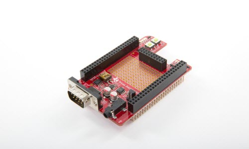

# TI BeagleBone Black PRU Cape

## Description

The TI PRU Cape is a BeagleBone Black add-on board that allows users get to know TI’s
powerful Programmable Real-Time Unit (PRU) core and basic functionality.
The PRU is a low-latency microcontroller subsystem integrated in the Sitara AM335x and
AM437x family of devices.
The PRU core is optimized for deterministic, real-time processing, direct access to I/Os
and ultra-low-latency requirements.
It includes LEDs and push buttons for GPIO, audio, and a temperature sensor.
Together the BeagleBone Black and PRUCAPE are an ideal EVM solution to begin PRU development
on the Sitara platform.

## Features

- Temperature sensor monitoring using 1-wire interface

- LCD Connector for optional character display (not included). Compatible with Newhaven NHD-0208AZ-RN-YBW-33V

- Audio jack connection output

- Dual GPIO push button switch

- LEDs

### PRUCAPE

- Expansion Connector- Connection to BeagleBone / BeagleBone Black

- UART- Hardware UART to PRU Subsystem

- Sensors-Temperature sensor monitoring using 1-wire interface

- LCD- LCD Connector for optional character display (not included).
  Compatible with Newhaven NHD-0208AZ-RN-YBW-33V

- Audio-Audio jack connection output

- GPIO-Dual GPIO push button switch

- LEDs- Bank of PRU0 & PRU1 LEDs

- Price (USD) Per Unit- $39.00

- Version Date - Oct 2014

## What's Included

- BeagleBone Black compatible plug-in board (“cape”)

## Technical Documentation

[PRU Cape Getting Started Guide](PRU_GS.md)

[PRU Cape Hardware User Guide](PRU_HUG.md)

